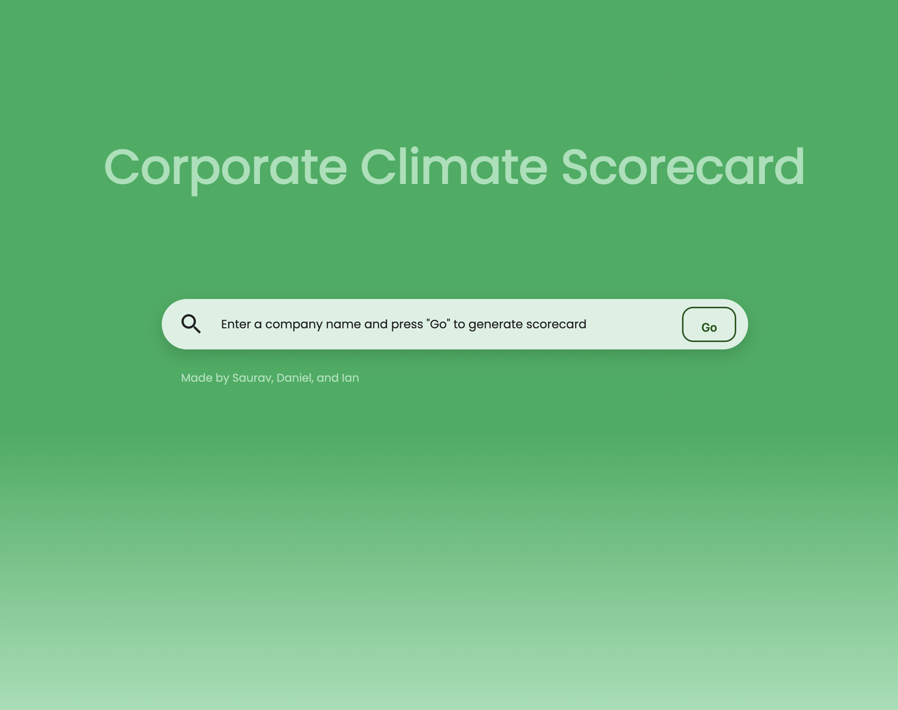
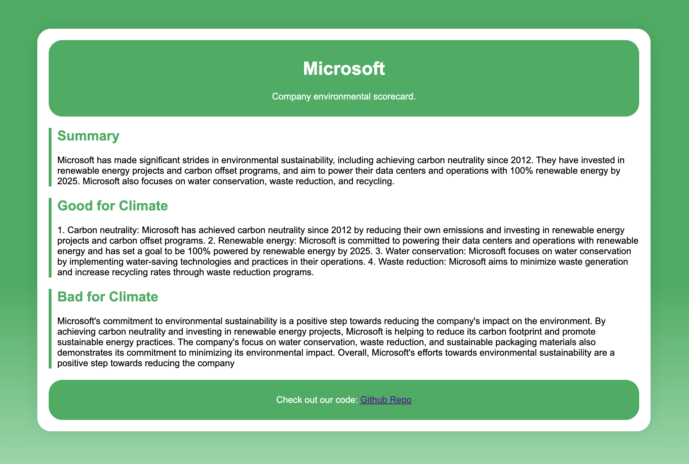

# Company Climate RAG LlamaIndex

# Introduction
In the wake of urgent climate action, *we envisioned a tool that could quantify corporate sustainability efforts and inspire real change*. Imagine if businesses could navigate the complexities of sustainability like they check their credit scores.

# What it does?
Utilizing the cutting-edge Llama-Index, our platform provides a robust and dynamic assessment of a company's environmental impact. Firstly, we extract unstructured data from Wikipedia from **LlamaIndex** data loaders. Next, we performing chunking/segmentation to chunk the long-context data and store the data in **MongoDB vectorstore**. Finally, given a query we performing LlamaIndex recursive retrieval + document agent architecture to route the query to the most relevant document agent. Finally, we pass the relevant chunks to **Llama2** from **Together AI** for efficient question answering.

# Tools
- MongoDB Atlas Vector Search
- Llama2-chat (7B)
- Llama-index
- TogetherAI

# Reference
- https://gpt-index.readthedocs.io/en/latest/examples/query_engine/recursive_retriever_agents.html
- https://llamahub.ai/l/wikipedia
- https://gpt-index.readthedocs.io/en/latest/examples/vector_stores/MongoDBAtlasVectorSearch.html
- https://docs.together.ai/docs/examples
